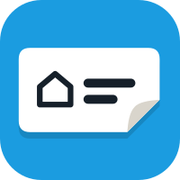

<p align="center">
  
</p>

<h1 align="center">Label Studio for DYMO</h1>

<p align="center">
  Design and print labels on a USB DYMO LabelWriter from your browser. Runs as a Docker container.
</p>

Label Studio for DYMO turns a LabelWriter on your home server into a label printer for the whole house. Design labels in the browser with a live preview, save them as templates, and print them from any device on your network, from a script, or over MQTT.

## Features

- **Label designer** with a live preview, five fonts, and text that wraps, hyphenates and resizes to fit the label.
- **Icons, emoji and QR codes**: search all Material Design Icons, and place the image left, right, above or below the text.
- **Labels with live data**: dates filled in when printing, and templates such as `{{ now().strftime('%d-%m') }}`.
- **Every LabelWriter 400/450 label size**, with favourites and a print correction per label type.
- **Print from anywhere**: the web interface, an HTTP API, or MQTT, with automatic buttons in Home Assistant and other systems that support MQTT discovery.
- **Network printer** (optional): share the LabelWriter with computers and phones over Bonjour/AirPrint.
- **Password protection** (optional), for when your network isn't only yours.

## Requirements

- A Linux machine with Docker, on amd64 or arm64 (for example a Raspberry Pi 4 or 5).
- A DYMO LabelWriter of the 400 or 450 series, connected by USB. The 4XL and the 550 series are not supported.

The printer shows up on the host as `/dev/usb/lp0` (through the `usblp` kernel module, which most Linux distributions load automatically).

## Quick start

Create a `docker-compose.yml`:

```yaml
services:
  dymo-label-studio:
    image: ghcr.io/madeby0203/dymo-label-studio:latest
    container_name: dymo-label-studio
    restart: unless-stopped
    ports:
      - "8080:8080"
    devices:
      - /dev/usb/lp0:/dev/usb/lp0
    volumes:
      - ./data:/data
    environment:
      TZ: Europe/Amsterdam
```

Run `docker compose up -d` and open `http://<your-server>:8080`. Click the cog to choose your label sizes, then design and print.

A fuller example with every option is in [docker-compose.yml](docker-compose.yml).

## Configuration

All settings are optional environment variables. Most printer settings can also be changed in the web interface.

| Variable | Default | Description |
|---|---|---|
| `TZ` | UTC | Your time zone, for dates and times on labels. |
| `PORT` | `8080` | Port of the web interface. |
| `PRINTER_DEVICE` | `/dev/usb/lp0` | The printer's device inside the container. |
| `PRINTER_CONNECTION` | `direct` | `direct` for USB, or `cups` to print through a CUPS printer. |
| `CUPS_PRINTER` | `DYMO` | The CUPS printer name, with the `cups` connection. |
| `MQTT_HOST` | | Your MQTT broker. Without it, MQTT is off. |
| `MQTT_PORT` | `1883` | |
| `MQTT_USERNAME`, `MQTT_PASSWORD` | | Broker login, if needed. |
| `MQTT_TOPIC` | `dymo_label_studio` | Base topic for everything this app publishes and listens to. |
| `MQTT_DISCOVERY_PREFIX` | `homeassistant` | Prefix for MQTT discovery; `off` to publish no discovery buttons. |
| `HA_URL`, `HA_TOKEN` | | Your Home Assistant and a long-lived access token, to use entity states in templates. |
| `RESET_PASSWORD` | | `true` turns password protection off at start (see below). |

Settings, templates and the password are stored in `/data`; keep it on a volume.

## Templates

Text and QR codes can contain [Jinja](https://jinja.palletsprojects.com/) templates, filled in at the moment of printing:

| Template | Prints |
|---|---|
| `{{ now().strftime('%d-%m-%Y') }}` | today's date |
| `{{ now().strftime('%H:%M') }}` | the current time |
| `{{ (now() + timedelta(days=3)).strftime('%d-%m') }}` | a date 3 days from now |
| `{{ states('sensor.freezer_temperature') }}` | a Home Assistant entity (needs `HA_URL` and `HA_TOKEN`) |

Templates run in a sandbox. With `HA_URL` and `HA_TOKEN` set, Home Assistant renders them instead, so everything its templates can do works.

## Printing from other programs

### HTTP

```sh
curl -X POST http://server:8080/api/print \
  -H 'Content-Type: application/json' \
  -d '{"text": "Milk\nOpened {{ now().strftime(\"%d-%m\") }}", "icon": "mdi:fridge", "label_size": "11354"}'
```

Print a saved template with `POST /api/templates/<name>/print`; fields in the body override the template. With password protection on, send the password with HTTP Basic auth: `curl -u :yourpassword ...`.

### MQTT

With `MQTT_HOST` set, under the base topic (`dymo_label_studio` by default):

| Topic | |
|---|---|
| `<base>/print` | Publish a label as JSON to print it, or `{"template": "Opened"}` for a saved template. |
| `<base>/template/<name>/press` | Publish anything to print that template. |
| `<base>/templates` | The saved templates and their topics (retained). |
| `<base>/last_print` | The result of the latest print. |
| `<base>/status` | `online` or `offline`. |

Every template is also announced through MQTT discovery, so it appears as a button in **Home Assistant**, openHAB and other systems that support it, together with a *Last print* sensor.

### Label fields

| Field | Values |
|---|---|
| `text` | The text; one line per `\n`. Templates allowed. |
| `label_size` | A DYMO label number, such as `11354` (57 × 32 mm) or `99010` (89 × 28 mm). |
| `graphic` | `icon`, `qr`, or empty for no image. |
| `icon` | `mdi:name` or an emoji. |
| `qr` | The QR code's content. Templates allowed. |
| `image_position` | `left`, `right`, `top` or `bottom`. |
| `icon_size` | Image size, 20–100 (% of the largest that fits). |
| `font` | `roboto`, `roboto-condensed`, `dejavu-sans`, `dejavu-serif` or `dejavu-mono`. |
| `weight` | `bold` or `regular`. |
| `align` | `left`, `center` or `right`. |
| `text_size` | Font size in points; `0` or omitted for automatic. |
| `language` | Hyphenation: `nl_NL`, `en_US`, `de_DE` or `fr`. |
| `date` | `today` (filled in when printing), a date such as `2026-09-29`, or free text. |
| `date_format` | `%d-%m-%Y`, `%d/%m/%Y`, `%Y-%m-%d`, `%d %b %Y` or `%a %d %b`. |
| `icon_margin`, `text_margin`, `gap` | Spacing in mm. |
| `copies` | Number of labels. |

## Label sizes and print corrections

All 55 labels of DYMO's LabelWriter 400/450 driver are available. Under **Settings → Label sizes**, tick the ones you use and choose a default. If a label type prints off-centre, set a correction for it in mm: horizontal **+** moves the print right, vertical **−** moves it up.

## Network printer

Turn on **Share this printer on the network** under **Settings**, and computers and phones can print to the LabelWriter like any other printer. It uses CUPS with DYMO's own driver and is announced over Bonjour/AirPrint as **DYMO LabelWriter**.

Announcements only reach your network when the container uses the host network: replace `ports` with `network_mode: host` in `docker-compose.yml`. Without it, add the printer by address: `ipp://<your-server>:631/printers/DYMO` (publish port 631 too).

## Password protection

Anyone who can open the web interface can print and change settings. To require a password, open **Settings → Security → Set a password**. Scripts then send the password with HTTP Basic auth; MQTT is not affected.

Forgot the password? Set `RESET_PASSWORD: "true"`, restart the container, remove the variable again and set a new password.

## Troubleshooting

- **The container doesn't start: "no such file or directory" for `/dev/usb/lp0`:** the printer is off or not connected. Check `ls /dev/usb` on the host.
- **"USB printer device does not exist" when printing:** the printer was reconnected after the container started. Restart the container.
- **Labels print too high, too low or off to one side:** set a print correction for that label size.
- **A CUPS installation on the host** can claim the printer. Stop it, or use the `cups` connection instead.

## Home Assistant OS

Using Home Assistant OS or Supervised? The same label designer is available as a Home Assistant app, with sidebar integration and your Home Assistant theme: [ha-label-studio](https://github.com/madeby0203/ha-label-studio).

## Development

```sh
pip install -r app/requirements.txt pytest
pytest tests
docker build -t dymo-label-studio .
```

Pushes to `main` publish `ghcr.io/madeby0203/dymo-label-studio:latest` for amd64 and arm64; tags such as `v1.0.0` publish `1.0.0` and `1.0` as well.

## License

[MIT](LICENSE). Not affiliated with or endorsed by DYMO. DYMO and LabelWriter are trademarks of their respective owner.
